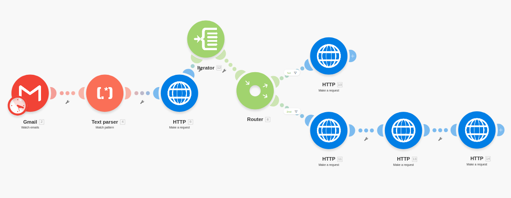
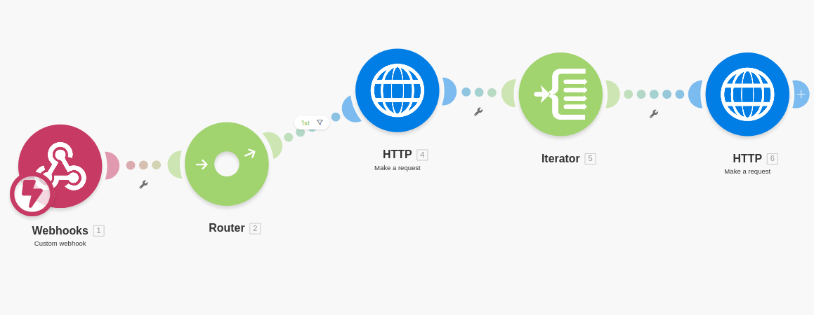

# Background Check & Subscription Automation System

A no-code / low-code automation system that manages paid subscriptions and background verification workflows using WordPress, Groundhogg CRM, Make.com, email-based triggers, and the BackgroundChecks API.

---

## Overview

This project automates provider onboarding and verification by handling subscription payments, background check fee payments, candidate creation, background check initiation, status tracking, and CRM updates. The system minimizes manual administrative work and is designed to be modular, production-safe, and reversible, with no direct dependency on WordPress core or server-level changes.

---

## Table of Contents
- [Features](#features)
- [Screenshots](#screenshots)
- [Tech Stack](#tech-stack)
- [Getting Started](#getting-started)
- [Usage](#usage)
- [Configuration](#configuration)
- [Contributing](#contributing)
- [License](#license)

---

## Features
- Automated monthly subscription detection
- Role-based CRM tagging (Provider / Family)
- Background check fee payment automation
- Candidate creation via BackgroundChecks API
- Background check initiation and tracking
- Webhook-based status updates from BackgroundChecks
- Automated CRM tagging based on verification status
- Provider and admin email notifications via Groundhogg
- Duplicate protection and fail-safe processing

---

## Screenshots

> Screenshots are placeholders and can be replaced with actual workflow or dashboard images.

---

## Tech Stack
- CMS: WordPress
- CRM: Groundhogg
- Automation: Make.com
- Payments: Stripe (via WordPress forms)
- APIs: BackgroundChecks API
- Triggers: Email-based triggers, Webhooks
- Security: API keys, Application Passwords, HMAC verification

---

## Getting Started

### Prerequisites
- WordPress site with Groundhogg installed
- Make.com account
- BackgroundChecks sandbox account
- Email inbox accessible to Make.com
- Stripe account (for payment handling)

### Setup Overview
- Configure Groundhogg tags and email automations
- Create Make.com scenarios for email triggers and webhooks
- Configure BackgroundChecks API credentials
- Register webhook endpoint in BackgroundChecks
- Connect WordPress forms and payment notifications

---

## Usage

Once the system is live:

- Subscription payments automatically update CRM tags
- Background check fee payments trigger provider instructions
- BackgroundChecks API handles candidate creation and verification
- Webhook updates automatically reflect verification results in CRM
- Providers and admins receive status-based notifications

All workflows operate automatically once enabled.

---

## Configuration

Sensitive credentials are managed externally and not hardcoded.

Typical configuration includes:
- BackgroundChecks API keys (sandbox / production)
- WordPress Application Password for CRM API access
- Make.com connections for email, HTTP, and webhooks
- Stripe API keys for payment processing

All secrets are stored securely within Make.com.

---

## Contributing

This project is currently maintained internally.

For enhancements or modifications:
- Propose changes with a clear description
- Ensure new logic maintains idempotency and fail-safe behavior
- Validate changes in sandbox before production enablement

---

## License

This project is proprietary and intended for internal or client-specific use. Redistribution or reuse requires explicit permission.

---

## Contact / Credits

Project designed, implemented, and documented by **Relu Consultancy**.

For support, maintenance, or future enhancements, please contact the project maintainer.
